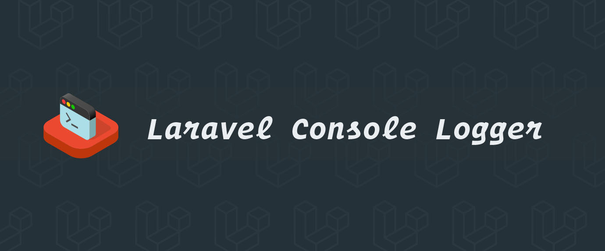
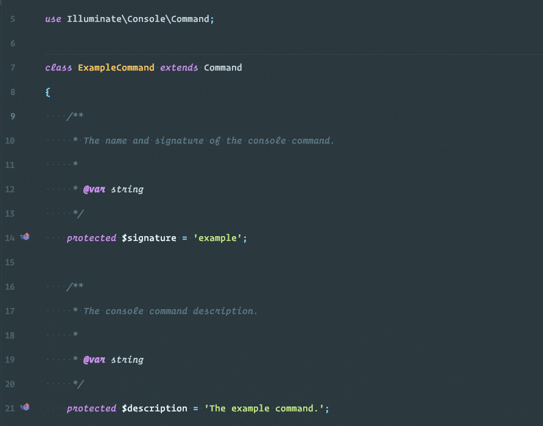

# Laravel Console Logger

[](https://patreon.com/dmitryivanov)

[](https://styleci.io/repos/61117768)
[](https://travis-ci.com/dmitry-ivanov/laravel-console-logger)
[](https://coveralls.io/github/dmitry-ivanov/laravel-console-logger?branch=7.x)

[](https://packagist.org/packages/illuminated/console-logger)
[](https://packagist.org/packages/illuminated/console-logger)
[](https://packagist.org/packages/illuminated/console-logger)
[](https://packagist.org/packages/illuminated/console-logger)

Logging and Notifications for Laravel Console Commands.

| Laravel | Console Logger                                                            |
| ------- | :-----------------------------------------------------------------------: |
| 7.x     | [7.x](https://github.com/dmitry-ivanov/laravel-console-logger/tree/7.x)   |
| 6.x     | [6.x](https://github.com/dmitry-ivanov/laravel-console-logger/tree/6.x)   |
| 5.8.*   | [5.8.*](https://github.com/dmitry-ivanov/laravel-console-logger/tree/5.8) |
| 5.7.*   | [5.7.*](https://github.com/dmitry-ivanov/laravel-console-logger/tree/5.7) |
| 5.6.*   | [5.6.*](https://github.com/dmitry-ivanov/laravel-console-logger/tree/5.6) |
| 5.5.*   | [5.5.*](https://github.com/dmitry-ivanov/laravel-console-logger/tree/5.5) |
| 5.4.*   | [5.4.*](https://github.com/dmitry-ivanov/laravel-console-logger/tree/5.4) |
| 5.3.*   | [5.3.*](https://github.com/dmitry-ivanov/laravel-console-logger/tree/5.3) |
| 5.2.*   | [5.2.*](https://github.com/dmitry-ivanov/laravel-console-logger/tree/5.2) |
| 5.1.*   | [5.1.*](https://github.com/dmitry-ivanov/laravel-console-logger/tree/5.1) |



## Table of contents

- [Usage](#usage)
- [Available methods](#available-methods)
- [Channels](#channels)
  - [File channel](#file-channel)
  - [Notification channels](#notification-channels)
    - [Email channel](#email-channel)
    - [Database channel](#database-channel)
- [Error handling](#error-handling)
  - [Exceptions with context](#exceptions-with-context)
- [Guzzle 6+ integration](#guzzle-6-integration)
- [Powered by Monolog](#powered-by-monolog)
- [Troubleshooting](#troubleshooting)
  - [Trait included, but nothing happens?](#trait-included-but-nothing-happens)
  - [Several traits conflict?](#several-traits-conflict)
- [License](#license)

## Usage

1. Install the package via Composer:

    ```shell script
    composer require "illuminated/console-logger:^7.0"
    ```

2. Use `Illuminated\Console\Loggable` trait:

    ```php
    use Illuminated\Console\Loggable;

    class ExampleCommand extends Command
    {
        use Loggable;

        public function handle()
        {
            $this->logInfo('Hello World!');
        }

        // ...
    }
    ```

3. Run the command and check your logs:

    ```
    [2020-05-11 17:19:21]: [INFO]: Command `App\Console\Commands\ExampleCommand` initialized.
    [2020-05-11 17:19:21]: [INFO]: Host: `MyHost.local` (`10.0.1.1`).
    [2020-05-11 17:19:21]: [INFO]: Database host: `MyHost.local`, port: `3306`, ip: ``.
    [2020-05-11 17:19:21]: [INFO]: Database date: `2020-05-11 17:19:21`.
    [2020-05-11 17:19:21]: [INFO]: Hello World!
    [2020-05-11 17:19:21]: [INFO]: Execution time: 0.009 sec.
    [2020-05-11 17:19:21]: [INFO]: Memory peak usage: 8 MB.
    ```

## Available methods

The `Loggable` trait provides these [PSR-3](http://www.php-fig.org/psr/psr-3/) methods:

- `logDebug()`
- `logInfo()`
- `logNotice()`
- `logWarning()`
- `logError()`
- `logCritical()`
- `logAlert()`
- `logEmergency()`

Use them in your console commands to log required information.

## Channels

Log messages could be handled in multiple different ways.

It might be writing data into the log file, storing it in the database, sending an email, etc.

### File channel

File channel simply writes log messages into the log file.

Each of the commands would have a separate folder within the `storage/logs` dir.

For example, `foo-bar` command logs would be stored in the `storage/logs/foo-bar` folder.

You can customize the storage folder, and the max number of stored log files by overriding proper methods:

```php
class ExampleCommand extends Command
{
    use Loggable;

    protected function getLogPath()
    {
        return storage_path('logs/custom-folder/date.log');
    }

    protected function getLogMaxFiles()
    {
        return 45;
    }

    // ...
}
```

## Notification channels

If you want to be notified about errors in your console commands - use notification channels.

Notification channels are optional and disabled by default. Each of them could be enabled and configured as needed.

By default, you'll get notifications with a level higher than NOTICE (see [PSR-3 log levels](https://www.php-fig.org/psr/psr-3/#5-psrlogloglevel)).
It means that you'll get NOTICE, WARNING, ERROR, CRITICAL, ALERT, and EMERGENCY notifications, by default.

Of course, you can customize that, as well as other channel-specific details.

### Email channel

The email channel provides notifications via email.

Set the recipients, and email notifications are ready to go!

```php
class ExampleCommand extends Command
{
    use Loggable;

    protected function getEmailNotificationsRecipients()
    {
        return [
            ['address' => 'john.doe@example.com', 'name' => 'John Doe'],
            ['address' => 'jane.smith@example.com', 'name' => 'Jane Smith'],
        ];
    }

    // ...
}
```

There's a bunch of methods related to the email channel.

By overriding those methods, you can change the subject, `from` address, notification level, etc.

Deduplication is another useful feature worth mentioning. Sometimes the same error might occur many times in a row.
For example, you're using an external web service that is down. Or imagine that the database server goes down.
You'll get a lot of similar emails in those cases. Deduplication is the right solution for that.

You can enable it and adjust the time in seconds, for which deduplication works:

```php
class ExampleCommand extends Command
{
    use Loggable;

    protected function useEmailNotificationsDeduplication()
    {
        return true;
    }

    protected function getEmailNotificationsDeduplicationTime()
    {
        return 90;
    }

    // ...
}
```

### Database channel

The database channel provides a way to save notifications in the database.

The easiest way to start using it:

```php
class ExampleCommand extends Command
{
    use Loggable;

    protected function useDatabaseNotifications()
    {
        return true;
    }

    // ...
}
```

Notifications would be stored in the `iclogger_notifications` table, which would be automatically created if it doesn't exist yet.

Of course, you can customize the table name, and even the saving logic, by overriding proper methods:

```php
class ExampleCommand extends Command
{
    use Loggable;

    protected function useDatabaseNotifications()
    {
        return true;
    }

    protected function getDatabaseNotificationsTable()
    {
        return 'custom_notifications';
    }

    protected function getDatabaseNotificationsCallback()
    {
        return function (array $record) {
            CustomNotification::create([
                'level' => $record['level'],
                'level_name' => $record['level_name'],
                'message' => $record['message'],
                'context' => get_dump($record['context']),
                'custom_field' => 'Foo Bar Baz!',
            ]);
        };
    }

    // ...
}
```

## Error handling

Another cool feature that is enabled by default - is error handling.

The package automatically logs everything for you:
severe problems - exceptions and fatal errors, and even small things, such as PHP notices and warnings.

Add notifications to that, and you'll immediately know when something goes wrong in your console commands!

### Exceptions with context

Sometimes it's useful to pass an additional context of the thrown exception.

Use the `Illuminated\Console\Exceptions\RuntimeException` for that:

```php
use Illuminated\Console\Exceptions\RuntimeException;

class ExampleCommand extends Command
{
    use Loggable;

    public function handle()
    {
        throw new RuntimeException('Whoops! We have a problem!', [
            'some' => 123,
            'extra' => true,
            'context' => null,
        ]);
    }

    // ...
}
```

```
[2020-05-11 17:19:21]: [ERROR]: Whoops! We have a problem!
array:5 [
    "code" => 0
    "message" => "Whoops! We have a problem!"
    "file" => "/Applications/MAMP/htdocs/icl-test/app/Console/Commands/ExampleCommand.php"
    "line" => 22
    "context" => array:3 [
        "some" => 123
        "extra" => true
        "context" => null
    ]
]
```

## Guzzle 6+ integration

If you're using [Guzzle](https://github.com/guzzle/guzzle), you might want to have a full log of your HTTP interactions.

The `iclogger_guzzle_middleware()` function provides a pre-configured [Guzzle Middleware](https://docs.guzzlephp.org/en/stable/handlers-and-middleware.html) for that:

```php
use GuzzleHttp\Client;
use GuzzleHttp\HandlerStack;

// Create a log middleware
$logMiddleware = iclogger_guzzle_middleware($logger);

// Add it to the HandlerStack
$handler = HandlerStack::create();
$handler->push($logMiddleware);

// Use the created handler in your Guzzle Client
$client = new Client([
    'handler' => $handler,
    'base_uri' => 'https://example.com',
]);

// Now, all your HTTP requests and responses would be logged automatically!
// $client->get('/foo');
```

If you're using JSON, you might want to get auto decoding for your request params and response bodies:

```php
$logMiddleware = iclogger_guzzle_middleware($logger, 'json');
```

Also, you can disable logging of specific request params and/or response bodies, based on your custom logic:

```php
use Psr\Http\Message\RequestInterface;
use Psr\Http\Message\ResponseInterface;

// Disable logging of request params for the `/foo` endpoint
$shouldLogRequestParams = function (RequestInterface $request) {
    return ! str_ends_with($request->getUri(), '/foo');
};

// Disable logging of response bodies greater than 100 KB
$shouldLogResponseBody = function (RequestInterface $request, ResponseInterface $response) {
    return $response->getHeaderLine('Content-Length') < 102400;
};

$logMiddleware = iclogger_guzzle_middleware($logger, 'json', $shouldLogRequestParams, $shouldLogResponseBody);
```

## Powered by Monolog

This package uses the powerful [Monolog Logger](https://github.com/Seldaek/monolog).

You can access the underlying instance of Monolog by:

- Using the command's `icLogger()` method:

    ```php
    class ExampleCommand extends Command
    {
        use Loggable;

        public function handle()
        {
            $logger = $this->icLogger();
        }

        // ...
    }
    ```

- Or via the Laravel's Service Container:

    ```php
    $logger = app('log.iclogger');
    ```

## Troubleshooting

### Trait included, but nothing happens?

`Loggable` trait overrides the `initialize()` method:

```php
trait Loggable
{
    protected function initialize(InputInterface $input, OutputInterface $output)
    {
        $this->initializeLogging();

        parent::initialize($input, $output);
    }

    // ...
}
```

If your command overrides the `initialize()` method too, you have to call the `initializeLogging()` method by yourself:

```php
class ExampleCommand extends Command
{
    use Loggable;

    protected function initialize(InputInterface $input, OutputInterface $output)
    {
        // You have to call it first
        $this->initializeLogging();

        // Then goes your custom code
        $this->foo = $this->argument('foo');
        $this->bar = $this->argument('bar');
        $this->baz = $this->argument('baz');
    }

    // ...
}
```

### Several traits conflict?

If you're using another `illuminated/console-%` package, you'll get the "traits conflict" error.

For example, if you're building a loggable command, which [doesn't allow overlapping](https://github.com/dmitry-ivanov/laravel-console-mutex):

```php
class ExampleCommand extends Command
{
    use Loggable;
    use WithoutOverlapping;

    // ...
}
```

You'll get the traits conflict, because both of those traits are overriding the `initialize()` method:
> If two traits insert a method with the same name, a fatal error is produced, if the conflict is not explicitly resolved.

To fix that - override the `initialize()` method and resolve the conflict:

```php
class ExampleCommand extends Command
{
    use Loggable;
    use WithoutOverlapping;

    protected function initialize(InputInterface $input, OutputInterface $output)
    {
        // Initialize conflicting traits
        $this->initializeMutex();
        $this->initializeLogging();
    }

    // ...
}
```

## License

Laravel Console Logger is open-sourced software licensed under the [MIT license](LICENSE.md).

[](https://patreon.com/dmitryivanov)
