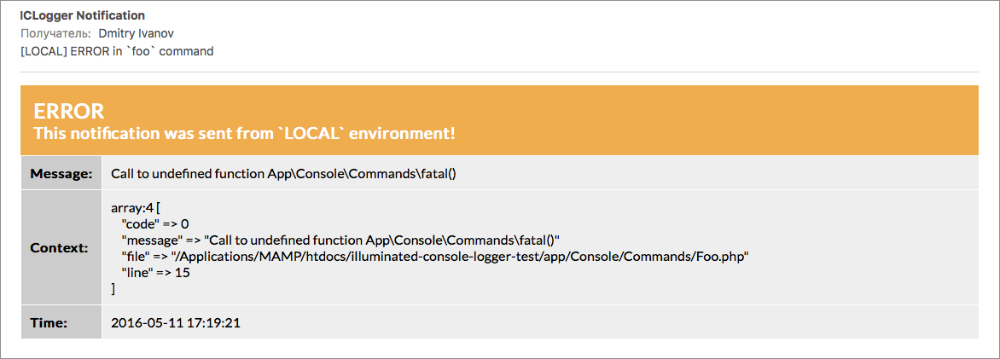

# Laravel console logger

[](https://styleci.io/repos/61117768)
[](https://insight.sensiolabs.com/projects/b6404099-b40b-4c59-8e71-5140a390f018)

Provides logging and email notifications for Laravel console commands.

## Dependencies
- `PHP >=5.5.9`
- `Laravel >=5.2`

## Usage

1. Install package through `composer`:
    ```shell
    composer require illuminated/console-logger
    ```

2. Use `Illuminated\Console\Loggable` trait and specify notification recipients:
    ```php
    namespace App\Console\Commands;

    use Illuminate\Console\Command;
    use Illuminated\Console\Loggable;

    class Foo extends Command
    {
        use Loggable;

        protected function getNotificationRecipients()
        {
            return [
                ['address' => 'john.doe@example.com', 'name' => 'John Doe'],
                ['address' => 'jane.smith@example.com', 'name' => 'Jane Smith'],
            ];
        }

        // ...
    }
    ```

3. Now your command is loggable!

    You have logs separated by commands and by dates, auto-rotation, global error handler, email notifications for any kind of errors (even for PHP notices in your commands), auto saving to database, set of useful info added to each iteration, context support with nice dumps for each type of message and even more cool features right out of the box!

    These PSR-3 methods are available for you:
    - `logDebug`
    - `logInfo`
    - `logNotice`
    - `logWarning`
    - `logError`
    - `logCritical`
    - `logAlert`
    - `logEmergency`

    Here is the basic example of usage:
    ```php
    class Foo extends Command
    {
        use Loggable;

        public function handle()
        {
            $this->logInfo('Hello World!');
        }

        // ...
    }
    ```

    ```
    [2016-05-11 17:19:21]: [INFO]: Command `App\Console\Commands\Foo` initialized.
    [2016-05-11 17:19:21]: [INFO]: Host: `MyHost.local` (`10.0.1.1`).
    [2016-05-11 17:19:21]: [INFO]: Database host: `MyHost.local`, port: `3306`, ip: ``.
    [2016-05-11 17:19:21]: [INFO]: Database date: `2016-05-11 17:19:21`.
    [2016-05-11 17:19:21]: [INFO]: Hello World!
    [2016-05-11 17:19:21]: [INFO]: Execution time: 0.009 sec.
    [2016-05-11 17:19:21]: [INFO]: Memory peak usage: 8 MB.
    ```

## Location

Each command has a separate folder for it's logs. Path is generated according to the command's name.
For example, command `php artisan foo` would have it's logs on `./storage/logs/foo/` folder, and command `php artisan foo:bar` on `./storage/logs/foo/bar/`.
Log file names are corresponding to dates, and only latest thirty files are stored.

## Notifications

Notification recipients were set, so they would get email notifications according to execution process and log events.
By default, you'll get notification of each level which is higher than NOTICE (see [PSR-3 log levels](http://www.php-fig.org/psr/psr-3/#5-psr-log-loglevel)).
This means, that you'll get notification about each NOTICE, WARNING, ERROR, CRITICAL, ALERT and EMERGENCY, occurred while execution.

You can change this behaviour and customize other aspects of notifications too. Subject, "from address" and maybe some others, could be customized by overriding proper methods:

```php
use Monolog\Logger;

class Foo extends Command
{
    use Loggable;

    protected function getNotificationSubject()
    {
        return "Oups! %level_name% while execution!";
    }

    protected function getNotificationFrom()
    {
        return ['address' => 'no-reply@awesome.com', 'name' => 'My Awesome Notification'];
    }

    protected function getNotificationLevel()
    {
        return Logger::ERROR;
    }

    // ...
}
```

## Error handler

Each exception, error and even PHP notice or warning are handled for you. It would be automatically logged, and you'll get email notification. You'll know immediately if something went wrong while execution. Very useful for scheduled commands.

```php
class Foo extends Command
{
    use Loggable;

    public function handle()
    {
        fatal();
    }

    // ...
}
```

Fatal error is handled and logged:

```
[2016-05-11 17:19:21]: [ERROR]: Call to undefined function App\Console\Commands\fatal()
array:4 [
    "code" => 0
    "message" => "Call to undefined function App\Console\Commands\fatal()"
    "file" => "/Applications/MAMP/htdocs/illuminated-console-logger-test/app/Console/Commands/Foo.php"
    "line" => 15
]
```

And email notification is sent:



## Custom exceptions

You can throw an exception of any type from your code, and it would be properly handled by logger.
However, if you want to pass an additional context to your exception, use `Illuminated\Console\RuntimeException` class:

```php
use Illuminated\Console\RuntimeException;

class Foo extends Command
{
    use Loggable;

    public function handle()
    {
        throw new RuntimeException('Oooups! Houston, we have a problem!', [
            'some' => 123,
            'extra' => true,
            'context' => null,
        ]);
    }

    // ...
}
```

```
[2016-05-11 17:19:21]: [ERROR]: Oooups! Houston, we have a problem!
array:5 [
    "code" => 0
    "message" => "Oooups! Houston, we have a problem!"
    "file" => "/Applications/MAMP/htdocs/illuminated-console-logger-test/app/Console/Commands/Foo.php"
    "line" => 22
    "context" => array:3 [
        "some" => 123
        "extra" => true
        "context" => null
    ]
]
```

## Auto saving to database

Another cool feature available for you is auto saving notifications to database. Disabled by default, and available only if you are using `mysql` database connection.

To enable it just override `enableNotificationDbStoring` method. By default, you'll get `iclogger_notifications` table with all required notifications information, which if fine for the most cases.

However, you can customize database table name and even storing logic if needed:

```php
class Foo extends Command
{
    use Loggable;

    protected function enableNotificationDbStoring()
    {
        return true;
    }

    protected function getNotificationDbTable()
    {
        return 'my_custom_notifications';
    }

    protected function getNotificationDbCallback()
    {
        return function (array $record) {
            MyCustomNotification::create([
                'level' => $record['level'],
                'level_name' => $record['level_name'],
                'message' => $record['message'],
                'context' => get_dump($record['context']),
                'bar' => 'some-additional-data',
                'baz' => 'more-additional-data',
            ]);
        };
    }

    // ...
}
```

## Advanced

#### Custom location

Sometimes it's needed to change location of the log files. For example, you want it to be dependent on some command's argument.
If that is your case, just override `getLogPath` method in your command class:

```php
class Foo extends Command
{
    use Loggable;

    protected function getLogPath()
    {
        return storage_path('logs/anything/you/want/date.log');
    }

    // ...
}
```

#### Notifications deduplication

Often different console commands can produce similar errors. For example, maybe all of your commands are using some common external service. And if that service goes down, you'll get an error notification from each of your commands.
Or, another example, probably you're using database server. If it goes down - again, you'll get an error notification from each of your commands.
And this can be a problem, if you have a huge number of commands. You'll get hundreds of emails for a few hours.

The good news is that you can deduplicate notifications very easy. You can enable deduplication by overriding `enableNotificationDeduplication` method.

Also, you can adjust deduplication time, by overridding `getNotificationDeduplicationTime` method:

```php
class Foo extends Command
{
    use Loggable;

    protected function enableNotificationDeduplication()
    {
        return true;
    }

    protected function getNotificationDeduplicationTime()
    {
        return 90;
    }

    // ...
}
```

#### Notifications mail driver

In order to send an email notifications, package would check `mail` configuration of your Laravel project.
If you're using one of supported mail drivers, it would be used for email notifications automatically. Supported drivers are: `mail`, `smtp`, `sendmail`, `mandrill`.
If you're using something else, for example, `ses` or `sparkpost` - native PHP `mail()` function would be used as a driver.

Unfortunately, we're currently not supporting all of Laravel's mail drivers, because [Monolog email handlers](https://github.com/Seldaek/monolog/blob/master/doc/02-handlers-formatters-processors.md#send-alerts-and-emails) don't.
Maybe in future other drivers would be supported too.

However, you can totally change this behaviour, by overriding `getMailerHandler` method:
```php
class Foo extends Command
{
    use Loggable;

    protected function getMailerHandler()
    {
        $mailer = app('my-swift-mailer');

        $message = $mailer->createMessage();
        $message->setSubject('Hey! Something went wrong!');
        $message->setFrom(['no-reply@example.com' => 'My Notification System']);
        $message->setTo(['john.doe@example.com' => 'John Doe']);
        $message->setContentType('text/html');
        $message->setCharset('utf-8');

        return new SwiftMailerHandler($mailer, $message);
    }

    // ...
}
```

#### Guzzle 6 integration

If you're using [Guzzle](https://github.com/guzzle/guzzle), well, maybe you'll want to have logs of your http interactions.

There is a helper function `iclogger_guzzle_middleware`, which makes it very easy:

```php
use GuzzleHttp\Client;
use GuzzleHttp\HandlerStack;

$handler = HandlerStack::create();
$middleware = iclogger_guzzle_middleware($log);
$handler->push($middleware);

$client = new Client([
    'handler' => $handler,
    'base_uri' => 'http://example.com',
]);
```

Now, your guzzle interactions are fully loggable. Each request, response and even errors would be logged for you.
You can also set type, as a second argument. Set it to `json` to get auto json decoding for request params and response body.

And even more advanced options are the third and the fourth optional arguments, which are callbacks, by which you can minimize your logs if needed.
Both of them should return bool. `shouldLogRequest` determines if request bodies should be logged or not, and `shouldLogResponse` determines the same for the response bodies.
You can set here any of your custom logic here. For example, maybe you want to skip logging for just specific urls, or maybe you want to check content length of the response, etc.

```php
use Psr\Http\Message\RequestInterface;
use Psr\Http\Message\ResponseInterface;

$middleware = iclogger_guzzle_middleware($log, 'json',
    function (RequestInterface $request) {
        if (ends_with($request->getUri(), '/foo')) {
            return false; // skips logging for /foo request bodies
        }

        return true;
    },
    function (RequestInterface $request, ResponseInterface $response) {
        if (ends_with($request->getUri(), '/bar')) {
                return false; // skips logging for /bar response bodies
            }

            return true;
    }
);
```

#### Accessing Monolog instance

This package is using [Monolog logging library](https://packagist.org/packages/monolog/monolog) with all of it's power and benefits.
If needed, you may access the underlying Monolog instance in a two ways:

- Using `icLogger` command's method:
    ```php
    class Foo extends Command
    {
        use Loggable;

        public function handle()
        {
            $log = $this->icLogger();
        }

        // ...
    }
    ```

- Through Laravel service container:
    ```php
    $log = $app('log.iclogger');
    ```

## Troubleshooting

#### Trait included, but nothing happens?

Note, that `Loggable` trait is overriding `initialize` method:
```php
trait Loggable
{
    protected function initialize(InputInterface $input, OutputInterface $output)
    {
        $this->initializeLogging();
    }

    // ...
}
```

If your command is overriding `initialize` method too, then you should call `initializeLogging` method by yourself:
```php
class Foo extends Command
{
    use Loggable;

    protected function initialize(InputInterface $input, OutputInterface $output)
    {
        $this->initializeLogging();

        $this->bar = $this->argument('bar');
        $this->baz = $this->argument('baz');
    }

    // ...
}
```

#### Several traits conflict?

If you're using some other cool `illuminated/console-%` packages, well, then you can find yourself getting "traits conflict".
For example, if you're trying to build loggable command, which is [protected against overlapping](https://packagist.org/packages/illuminated/console-mutex):
```php
class Foo extends Command
{
    use Loggable;
    use WithoutOverlapping;

    // ...
}
```

You'll get fatal error, the "traits conflict", because both of these traits are overriding `initialize` method:
>If two traits insert a method with the same name, a fatal error is produced, if the conflict is not explicitly resolved.

But don't worry, solution is very simple. Just override `initialize` method by yourself, and initialize traits in required order:
```php
class Foo extends Command
{
    use Loggable;
    use WithoutOverlapping;

    protected function initialize(InputInterface $input, OutputInterface $output)
    {
        $this->initializeMutex();
        $this->initializeLogging();
    }

    // ...
}
```
